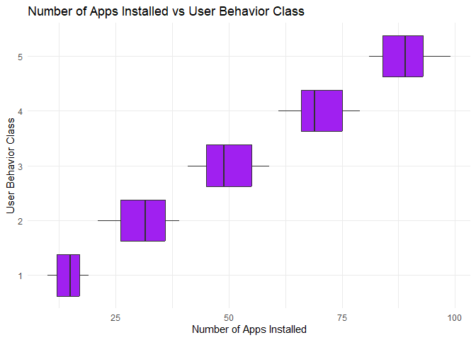
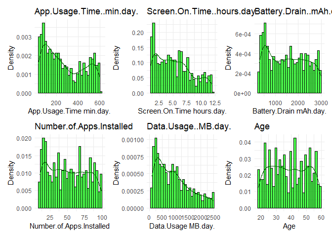

Final Project DS 202
================
Minh Nguyen, Bach Nguyen, Thien Nguyen
2024-12-17

## Abstract

This study analyzes mobile device usage patterns and user behavior
classifications based on various metrics such as **App Usage Time**,
**Screen-On Time**, **Battery Drain**, **Data Usage**, and **Number of
Apps Installed**. The dataset includes 700 users categorized into **five
behavior classes**, ranging from **light (Class 1)** to **extreme usage
(Class 5)**. Results show that higher behavior classes are associated
with increased Screen-On Time, Battery Drain, and Data Usage,
highlighting strong positive relationships among these usage metrics.
Gender differences were observed, with **males** generally dominating
higher behavior classes, while females in **Class 5** displayed slightly
higher Screen-On Time. Age, however, showed no significant correlation
with usage metrics. These findings provide insights into user behavior
trends, emphasizing how device usage patterns escalate with user
behavior intensity.

## Main Analysis - Curiosity

The analysis demonstrates a deep exploration of mobile device usage
patterns, focusing on key metrics like Screen-On Time, App Usage Time,
and Battery Drain to understand user behavior classes. Several trials
were conducted to identify trends, including examining correlations,
gender differences, and age distributions. The findings were refined to
present the most meaningful insights, such as the strong positive
relationships between usage metrics and behavior intensity. Additional
research and visualizations were used to validate these observations,
providing a clear explanation of how user behavior escalates across
different classes and highlighting areas for further investigation.

## Main analysis - Skepticism

The analysis critically examined the findings by using multiple
approaches, such as correlation heatmaps, boxplots, and histograms, to
verify relationships between variables. Unintuitive results, like the
lack of correlation between **Age** and other usage metrics, were
cross-checked with different visualizations to ensure accuracy. The
consistency of trends, such as the strong positive correlations between
**Screen-On Time**, **Battery Drain**, and **Data Usage**, was validated
across various techniques. This careful approach ensured the results
were reliable and reflected true user behavior patterns.

## Main analysis - Organization

The analysis of mobile device usage patterns focuses on exploring the
relationships between **User Behavior Classes** and key metrics, such as
**Screen-On Time**, **Battery Drain**, **Data Usage**, and **Number of
Apps Installed**, while also considering **Gender** and **Age Groups**.
Users were categorized into five classes, ranging from **light usage
(Class 1)** to **extreme usage (Class 5)**. Boxplots revealed that
**Screen-On Time**, **Battery Drain**, and **Data Usage** increased
steadily with higher behavior classes, suggesting that these metrics are
strong indicators of usage intensity. Gender-based analysis showed that
males generally dominate heavier behavior classes, but in **Class 5**,
females exhibited slightly higher **Screen-On Time**.

Additionally, the data was analyzed across **Age Groups** to understand
variations within behavior classes. Results showed that **Screen-On
Time** increased consistently with behavior classes across all age
groups, with no major differences among age categories. Histograms of
key metrics like App Usage Time, Battery Drain, and Data Usage revealed
right-skewed distributions, where most users had lower values, but a few
exhibited very high usage. The correlation heatmap confirmed strong
positive relationships between metrics like **Screen-On Time**, **App
Usage Time**, and **Battery Drain**, while **Age** showed no significant
correlation with any metric. This systematic analysis highlights the
strong connections between user behavior classes and device usage
metrics, providing a clear understanding of patterns and trends across
different user groups.

## Introduction

Understanding mobile device usage patterns is crucial in today’s digital
age, where smartphones play a significant role in daily life. This study
explores user behavior by analyzing metrics such as **App Usage Time**,
**Screen-On Time**, **Battery Drain**, **Number of Apps Installed**, and
**Data Usage**. Users are categorized into **five behavior classes**,
ranging from **light usage (Class 1)** to **extreme usage (Class 5)**.
The analysis highlights key trends, such as increased Screen-On Time and
Data Usage with higher behavior classes, as well as slight gender
differences in usage intensity. By uncovering these patterns, this study
provides insights into user habits and lays the groundwork for
developing predictive models to classify behavior, optimize app
performance, and improve digital well-being strategies.

## Importing libraries

``` r
library(RColorBrewer)
library(viridis)
```

    ## Warning: package 'viridis' was built under R version 4.4.2

    ## Loading required package: viridisLite

``` r
library(psych)
```

    ## Warning: package 'psych' was built under R version 4.4.2

``` r
library(dplyr)
```

    ## 
    ## Attaching package: 'dplyr'

    ## The following objects are masked from 'package:stats':
    ## 
    ##     filter, lag

    ## The following objects are masked from 'package:base':
    ## 
    ##     intersect, setdiff, setequal, union

``` r
library(ggplot2)
```

    ## 
    ## Attaching package: 'ggplot2'

    ## The following objects are masked from 'package:psych':
    ## 
    ##     %+%, alpha

``` r
library(patchwork)
```

    ## Warning: package 'patchwork' was built under R version 4.4.2

``` r
library(tidyr)
```

    ## Warning: package 'tidyr' was built under R version 4.4.2

``` r
library(corrplot)
```

    ## Warning: package 'corrplot' was built under R version 4.4.2

    ## corrplot 0.95 loaded

``` r
library(png)
library(magick)
```

    ## Warning: package 'magick' was built under R version 4.4.2

    ## Linking to ImageMagick 6.9.12.98
    ## Enabled features: cairo, freetype, fftw, ghostscript, heic, lcms, pango, raw, rsvg, webp
    ## Disabled features: fontconfig, x11

``` r
library(ggcorrplot)
```

    ## Warning: package 'ggcorrplot' was built under R version 4.4.2

``` r
library(gridExtra)
```

    ## Warning: package 'gridExtra' was built under R version 4.4.2

    ## 
    ## Attaching package: 'gridExtra'

    ## The following object is masked from 'package:dplyr':
    ## 
    ##     combine

## Data

The dataset contains **700 records** of mobile device usage behavior,
with users categorized into **five behavior classes** ranging from
**light usage (Class 1)** to **extreme usage (Class 5)**. Each record
includes the following features:

1.  **App Usage Time (minutes/day)**: Total time spent using mobile
    applications each day.  
2.  **Screen-On Time (hours/day)**: The number of hours the device
    screen remains active per day.  
3.  **Battery Drain (mAh/day)**: The daily battery consumption in
    milliampere-hours.  
4.  **Number of Apps Installed**: Total number of applications installed
    on the device.  
5.  **Data Usage (MB/day)**: The total amount of mobile data consumed
    per day.  
6.  **Age**: Age of the user in years.  
7.  **Gender**: Gender of the user, categorized as **Male** or
    **Female**.  
8.  **User Behavior Class**: A categorical variable representing user
    behavior intensity, with values:
    - **1**: Light usage  
    - **2**: Light-to-moderate usage  
    - **3**: Moderate usage  
    - **4**: Heavy usage  
    - **5**: Extreme usage

This dataset allows for the analysis of relationships between user
behavior classes and various device usage metrics, enabling the
identification of trends and patterns across different user groups.

Data link:
<https://www.kaggle.com/datasets/valakhorasani/mobile-device-usage-and-user-behavior-dataset/data>

## Load & Exploring Data

``` r
df <- read.csv("user_behavior_dataset.csv")
head(df)
```

    ##   User.ID   Device.Model Operating.System App.Usage.Time..min.day.
    ## 1       1 Google Pixel 5          Android                      393
    ## 2       2      OnePlus 9          Android                      268
    ## 3       3   Xiaomi Mi 11          Android                      154
    ## 4       4 Google Pixel 5          Android                      239
    ## 5       5      iPhone 12              iOS                      187
    ## 6       6 Google Pixel 5          Android                       99
    ##   Screen.On.Time..hours.day. Battery.Drain..mAh.day. Number.of.Apps.Installed
    ## 1                        6.4                    1872                       67
    ## 2                        4.7                    1331                       42
    ## 3                        4.0                     761                       32
    ## 4                        4.8                    1676                       56
    ## 5                        4.3                    1367                       58
    ## 6                        2.0                     940                       35
    ##   Data.Usage..MB.day. Age Gender User.Behavior.Class
    ## 1                1122  40   Male                   4
    ## 2                 944  47 Female                   3
    ## 3                 322  42   Male                   2
    ## 4                 871  20   Male                   3
    ## 5                 988  31 Female                   3
    ## 6                 564  31   Male                   2

``` r
df <- df[, !names(df) %in% "User.ID"]
tail(df)
```

    ##           Device.Model Operating.System App.Usage.Time..min.day.
    ## 695 Samsung Galaxy S21          Android                      564
    ## 696          iPhone 12              iOS                       92
    ## 697       Xiaomi Mi 11          Android                      316
    ## 698     Google Pixel 5          Android                       99
    ## 699 Samsung Galaxy S21          Android                       62
    ## 700          OnePlus 9          Android                      212
    ##     Screen.On.Time..hours.day. Battery.Drain..mAh.day. Number.of.Apps.Installed
    ## 695                        9.7                    2422                       83
    ## 696                        3.9                    1082                       26
    ## 697                        6.8                    1965                       68
    ## 698                        3.1                     942                       22
    ## 699                        1.7                     431                       13
    ## 700                        5.4                    1306                       49
    ##     Data.Usage..MB.day. Age Gender User.Behavior.Class
    ## 695                1985  34 Female                   5
    ## 696                 381  22   Male                   2
    ## 697                1201  59   Male                   4
    ## 698                 457  50 Female                   2
    ## 699                 224  44   Male                   1
    ## 700                 828  23 Female                   3

``` r
dim(df)
```

    ## [1] 700  10

``` r
nrow(df)
```

    ## [1] 700

``` r
ncol(df)
```

    ## [1] 10

``` r
str(df)
```

    ## 'data.frame':    700 obs. of  10 variables:
    ##  $ Device.Model              : chr  "Google Pixel 5" "OnePlus 9" "Xiaomi Mi 11" "Google Pixel 5" ...
    ##  $ Operating.System          : chr  "Android" "Android" "Android" "Android" ...
    ##  $ App.Usage.Time..min.day.  : int  393 268 154 239 187 99 350 543 340 424 ...
    ##  $ Screen.On.Time..hours.day.: num  6.4 4.7 4 4.8 4.3 2 7.3 11.4 7.7 6.6 ...
    ##  $ Battery.Drain..mAh.day.   : int  1872 1331 761 1676 1367 940 1802 2956 2138 1957 ...
    ##  $ Number.of.Apps.Installed  : int  67 42 32 56 58 35 66 82 75 75 ...
    ##  $ Data.Usage..MB.day.       : int  1122 944 322 871 988 564 1054 1702 1053 1301 ...
    ##  $ Age                       : int  40 47 42 20 31 31 21 31 42 42 ...
    ##  $ Gender                    : chr  "Male" "Female" "Male" "Male" ...
    ##  $ User.Behavior.Class       : int  4 3 2 3 3 2 4 5 4 4 ...

``` r
summary(df)
```

    ##  Device.Model       Operating.System   App.Usage.Time..min.day.
    ##  Length:700         Length:700         Min.   : 30.0           
    ##  Class :character   Class :character   1st Qu.:113.2           
    ##  Mode  :character   Mode  :character   Median :227.5           
    ##                                        Mean   :271.1           
    ##                                        3rd Qu.:434.2           
    ##                                        Max.   :598.0           
    ##  Screen.On.Time..hours.day. Battery.Drain..mAh.day. Number.of.Apps.Installed
    ##  Min.   : 1.000             Min.   : 302.0          Min.   :10.00           
    ##  1st Qu.: 2.500             1st Qu.: 722.2          1st Qu.:26.00           
    ##  Median : 4.900             Median :1502.5          Median :49.00           
    ##  Mean   : 5.273             Mean   :1525.2          Mean   :50.68           
    ##  3rd Qu.: 7.400             3rd Qu.:2229.5          3rd Qu.:74.00           
    ##  Max.   :12.000             Max.   :2993.0          Max.   :99.00           
    ##  Data.Usage..MB.day.      Age           Gender          User.Behavior.Class
    ##  Min.   : 102.0      Min.   :18.00   Length:700         Min.   :1.00       
    ##  1st Qu.: 373.0      1st Qu.:28.00   Class :character   1st Qu.:2.00       
    ##  Median : 823.5      Median :38.00   Mode  :character   Median :3.00       
    ##  Mean   : 929.7      Mean   :38.48                      Mean   :2.99       
    ##  3rd Qu.:1341.0      3rd Qu.:49.00                      3rd Qu.:4.00       
    ##  Max.   :2497.0      Max.   :59.00                      Max.   :5.00

``` r
describe(df)
```

    ##                            vars   n    mean     sd median trimmed     mad min
    ## Device.Model*                 1 700    2.99   1.43    3.0    2.99    1.48   1
    ## Operating.System*             2 700    1.21   0.41    1.0    1.14    0.00   1
    ## App.Usage.Time..min.day.      3 700  271.13 177.20  227.5  262.28  216.46  30
    ## Screen.On.Time..hours.day.    4 700    5.27   3.07    4.9    5.05    3.56   1
    ## Battery.Drain..mAh.day.       5 700 1525.16 819.14 1502.5 1502.34 1132.71 302
    ## Number.of.Apps.Installed      6 700   50.68  26.94   49.0   50.12   35.58  10
    ## Data.Usage..MB.day.           7 700  929.74 640.45  823.5  865.68  706.46 102
    ## Age                           8 700   38.48  12.01   38.0   38.45   16.31  18
    ## Gender*                       9 700    1.52   0.50    2.0    1.52    0.00   1
    ## User.Behavior.Class          10 700    2.99   1.40    3.0    2.99    1.48   1
    ##                             max range  skew kurtosis    se
    ## Device.Model*                 5     4  0.02    -1.33  0.05
    ## Operating.System*             2     1  1.43     0.05  0.02
    ## App.Usage.Time..min.day.    598   568  0.37    -1.26  6.70
    ## Screen.On.Time..hours.day.   12    11  0.46    -0.83  0.12
    ## Battery.Drain..mAh.day.    2993  2691  0.13    -1.28 30.96
    ## Number.of.Apps.Installed     99    89  0.11    -1.26  1.02
    ## Data.Usage..MB.day.        2497  2395  0.70    -0.47 24.21
    ## Age                          59    41  0.03    -1.24  0.45
    ## Gender*                       2     1 -0.08    -2.00  0.02
    ## User.Behavior.Class           5     4  0.02    -1.28  0.05

``` r
colSums(is.na(df))
```

    ##               Device.Model           Operating.System 
    ##                          0                          0 
    ##   App.Usage.Time..min.day. Screen.On.Time..hours.day. 
    ##                          0                          0 
    ##    Battery.Drain..mAh.day.   Number.of.Apps.Installed 
    ##                          0                          0 
    ##        Data.Usage..MB.day.                        Age 
    ##                          0                          0 
    ##                     Gender        User.Behavior.Class 
    ##                          0                          0

``` r
sum(duplicated(df))
```

    ## [1] 0

## Explanatory Data Analysis

``` r
# Distribution of User Behavior Classes
ggplot(df, aes(x = as.factor(User.Behavior.Class))) +
  geom_bar(fill = "skyblue") +
  labs(title = "Distribution of User Behavior Classes",
       x = "User Behavior Class",
       y = "Count") +
  theme_minimal()
```

<!-- -->

The graph shows the distribution of User Behavior Classes, ranging from
1 (light usage) to 5 (extreme usage). The counts across the classes are
fairly balanced, with Class 2 (light-to-moderate usage) having the
highest number of users. Classes 3, 4, and 5, representing increasing
levels of usage intensity, have slightly fewer users but remain
consistent in size. Interestingly, Class 1 (light usage) also holds a
significant proportion, suggesting that a notable portion of users
exhibit minimal device usage. Overall, the balanced distribution across
all classes ensures reliable insights for understanding and predicting
user behavior trends.

``` r
# The distribtuion of age by User Behavior Class
age_behavior_plot <- ggplot(df, aes(x = factor(User.Behavior.Class), y = Age)) +
  geom_boxplot(fill = "lightgreen") +
  labs(title = "Age Distribution by User Behavior Class", x = "User Behavior Class", y = "Age") +
  theme_minimal()
age_behavior_plot
```

<!-- -->

This boxplot shows the age distribution for each User Behavior Class
from light (1) to extreme (5) usage. The median age for all classes is
around 40 years, with no big differences between the groups. Class 1
(light usage) has a slightly younger median and less variation compared
to the other classes. Overall, the ages in all classes range from about
20 to 60 years, showing that user behavior doesn’t change much with age.

``` r
# The distribution of gender analysis
ggplot(df, aes(x = Gender, fill = Gender)) +
  geom_bar() +
  scale_fill_brewer(palette = "Set2") +  # Use a different palette (e.g., Set2)
  labs(title = "Gender Analysis", 
       x = "Gender", 
       y = "Total Devices") +
  theme_minimal() +
  theme(axis.text.x = element_text(angle = 0, hjust = 0.5)) +
  theme(plot.title = element_text(size = 16, hjust = 0.5))
```

<!-- -->

The bar chart shows the number of users by gender. There are slightly
more male users than female users in this dataset. Both groups have
similar totals, with males having a small lead. This means the data is
fairly even, which is good for comparing behavior between genders.

``` r
# The distribution of operating sytem analysis
ggplot(df, aes(x = Operating.System, fill = Operating.System)) +
  geom_bar() +
  scale_fill_viridis(discrete = TRUE) +  # Viridis for discrete categories
  labs(title = "Operating System Analysis", 
       x = "Operating System", 
       y = "Total Devices") +
  theme_minimal() +
  theme(axis.text.x = element_text(angle = 45, hjust = 1)) +
  theme(plot.title = element_text(size = 16, hjust = 0.5))
```

<!-- -->

The bar chart shows the number of users for each Operating System. Most
users in this dataset use Android, while fewer users use iOS. The
difference is large, with Android having more than twice as many users
as iOS. This suggests that Android devices are much more common among
the users in this dataset.

``` r
# Correlation heatmap
df$Gender <- as.factor(df$Gender)
cor_data <- df %>%
  select(App.Usage.Time..min.day., Screen.On.Time..hours.day., Battery.Drain..mAh.day., 
         Number.of.Apps.Installed, Data.Usage..MB.day., Age)
cor_matrix <- cor(cor_data)
corr_plot <- ggcorrplot(cor_matrix, lab = TRUE, title = "Correlation Heatmap")
corr_plot
```

<!-- -->

The correlation heatmap shows how different variables are related to
each other. App Usage Time, Screen-On Time, Battery Drain, Number of
Apps Installed, and Data Usage all have very strong positive
correlations (close to 1), meaning they increase together. However, Age
has no clear relationship with any of the other variables, as its
correlation values are close to zero. Overall, the strong relationships
among App Usage Time (minutes per day), Screen-On Time (hours per day),
Battery Drain (mAh per day), Number of Apps Installed, and Data Usage
(MB per day) suggest that these metrics are closely connected to how
users interact with their devices.

``` r
# Screen-On Time vs User Behavior Class
ggplot(df, aes(x = Screen.On.Time..hours.day., y = as.factor(User.Behavior.Class))) +
  geom_boxplot(fill = "lightgreen") +
  labs(title = "Screen-On Time vs User Behavior Class",
       x = "Screen-On Time (hours/day)",
       y = "User Behavior Class") +
  theme_minimal()
```

<!-- -->

The boxplot shows the relationship between Screen-On Time and User
Behavior Class. As the User Behavior Class increases from 1 (light
usage) to 5 (extreme usage), the Screen-On Time also increases. Users in
Class 1 have the lowest Screen-On Time, around 1 to 2 hours per day,
while users in Class 5 have the highest Screen-On Time, around 10 to 12
hours per day. It suggests that Screen-On Time is a strong indicator of
user behavior, with higher usage classes spending more time on their
devices.

``` r
# Battery Drain vs User Behavior Class
ggplot(df, aes(x = Battery.Drain..mAh.day., y = as.factor(User.Behavior.Class))) +
  geom_boxplot(fill = "lightcoral") +
  labs(title = "Battery Drain vs User Behavior Class",
       x = "Battery Drain (mAh/day)",
       y = "User Behavior Class") +
  theme_minimal()
```

<!-- -->

The boxplot shows the relationship between Battery Drain and User
Behavior Class. As the User Behavior Class increases from 1 (light
usage) to 5 (extreme usage), the Battery Drain also increases. Users in
Class 1 have the lowest Battery Drain, around 300 to 600 mAh/day, while
users in Class 5 have the highest Battery Drain, around 2500 to 3000
mAh/day. It suggests that higher usage behavior leads to more battery
consumption, which makes sense as increased activity drains the battery
faster.

``` r
# Data Usage vs User Behavior Class
ggplot(df, aes(x = Data.Usage..MB.day., y = as.factor(User.Behavior.Class))) +
  geom_boxplot(fill = "gold") +
  labs(title = "Data Usage vs User Behavior Class",
       x = "Data Usage (MB/day)",
       y = "User Behavior Class") +
  theme_minimal()
```

<!-- -->

The boxplot shows the relationship between Data Usage and User Behavior
Class. As the User Behavior Class increases from 1 (light usage) to 5
(extreme usage), the Data Usage also increases. Users in Class 1 use the
least data, around 100 to 300 MB/day, while users in Class 5 have the
highest data usage, around 2000 to 2500 MB/day. It suggests that users
with higher behavior classes consume more data daily, likely due to
increased app usage, streaming, or other online activities.

``` r
# Number of Apps Installed vs User Behavior Class
ggplot(df, aes(x = Number.of.Apps.Installed, y = as.factor(User.Behavior.Class))) +
  geom_boxplot(fill = "purple") +
  labs(title = "Number of Apps Installed vs User Behavior Class",
       x = "Number of Apps Installed",
       y = "User Behavior Class") +
  theme_minimal()
```

<!-- -->

The boxplot shows the relationship between the Number of Apps Installed
and User Behavior Class. As the User Behavior Class increases from 1
(light usage) to 5 (extreme usage), the number of apps installed also
increases. Users in Class 1 have the fewest apps, around 10 to 20, while
users in Class 5 have the most, around 80 to 100 apps. It suggests that
users with higher behavior classes tend to install and use more apps,
which is likely tied to their heavier device usage.

``` r
columns <- c('App.Usage.Time..min.day.', 'Screen.On.Time..hours.day.',
             'Battery.Drain..mAh.day.', 'Number.of.Apps.Installed',
             'Data.Usage..MB.day.', 'Age')

# Create individual histograms for each column
plots <- lapply(columns, function(col) {
  ggplot(df, aes_string(x = col)) +
    geom_histogram(aes(y = ..density..), bins = 30, fill = "green", color = "black", alpha = 0.7) +
    geom_density(color = "darkgreen") +
    labs(title = col, x = gsub("\\.\\.", " ", col), y = "Density") +
    theme_minimal()
})
```

    ## Warning: `aes_string()` was deprecated in ggplot2 3.0.0.
    ## ℹ Please use tidy evaluation idioms with `aes()`.
    ## ℹ See also `vignette("ggplot2-in-packages")` for more information.
    ## This warning is displayed once every 8 hours.
    ## Call `lifecycle::last_lifecycle_warnings()` to see where this warning was
    ## generated.

``` r
combined_plot <- Reduce(`+`, plots) + plot_layout(ncol = 3)
combined_plot
```

    ## Warning: The dot-dot notation (`..density..`) was deprecated in ggplot2 3.4.0.
    ## ℹ Please use `after_stat(density)` instead.
    ## This warning is displayed once every 8 hours.
    ## Call `lifecycle::last_lifecycle_warnings()` to see where this warning was
    ## generated.

<!-- -->

The histograms show the distribution of six variables: App Usage Time,
Screen-On Time, Battery Drain, Number of Apps Installed, Data Usage, and
Age. Most variables, like App Usage Time, Screen-On Time, and Data
Usage, are skewed to the right, meaning many users have lower values
while a few have very high values. Battery Drain and Number of Apps
Installed are more spread out across their ranges, with no clear
concentration in a specific area. The Age distribution is fairly
uniform, showing a balanced spread of users across different age groups.
It suggests that most usage metrics vary widely, with certain users
driving the higher values.

``` r
# Distribution of User Behavior Class by Gender
ggplot(df, aes(x = as.factor(User.Behavior.Class), fill = Gender)) +
  geom_bar(position = "dodge") +
  labs(title = "Distribution of User Behavior Classes by Gender",
       x = "User Behavior Class",
       y = "Count",
       fill = "Gender") +
  theme_minimal()
```

<!-- -->

The bar chart shows the distribution of User Behavior Classes by gender,
where classes range from 1 (light usage) to 5 (extreme usage). Males
generally have higher counts in most classes compared to females. In
Class 1 (light usage), males slightly outnumber females. Class 3
(moderate usage) shows a balanced count between males and females.
However, in Class 5 (extreme usage), males have a noticeably higher
count, suggesting that males are more likely to fall into the heavy
usage categories.

``` r
# Screen-On Time vs User Behavior Class by Gender
ggplot(df, aes(x = as.factor(User.Behavior.Class), y = Screen.On.Time..hours.day., fill = Gender)) +
  geom_boxplot() +
  labs(title = "Screen-On Time by User Behavior Class and Gender",
       x = "User Behavior Class",
       y = "Screen-On Time (hours/day)",
       fill = "Gender") +
  theme_minimal()
```

<!-- -->

The boxplot shows the Screen-On Time by User Behavior Class and Gender.
As the User Behavior Class increases from 1 (light usage) to 5 (extreme
usage), Screen-On Time also increases for both genders. In Class 1 and
2, males and females have similar Screen-On Time, ranging between 2 to 4
hours/day. However, in Class 5 (extreme usage), females tend to have
slightly higher Screen-On Time, with values reaching around 12
hours/day, compared to males. This suggests that in heavier usage
classes, Screen-On Time increases significantly, with slight gender
differences.

``` r
# Screen-On Time vs User Behavior Class by Age Group
df$Age.Group <- cut(df$Age, 
                    breaks = c(18, 25, 35, 45, 60), 
                    labels = c("18-25", "26-35", "36-45", "46-59"),
                    include.lowest = TRUE)

ggplot(df, aes(x = as.factor(User.Behavior.Class), 
               y = Screen.On.Time..hours.day., 
               fill = Age.Group)) +
  geom_boxplot() +
  labs(title = "Screen-On Time by User Behavior Class and Age Group",
       x = "User Behavior Class",
       y = "Screen-On Time (hours/day)",
       fill = "Age Group") +
  theme_minimal()
```

<!-- -->

## Conclusion

The exploratory data analysis (EDA) of the dataset reveals significant
trends in mobile device usage behavior across five user behavior classes
ranging from light to extreme usage. Key findings show that as the
behavior class increases, Screen-On Time, App Usage Time, Battery Drain,
Number of Apps Installed, and Data Usage also increase, suggesting a
strong connection between user behavior intensity and these metrics.
Gender differences were observed, with males generally dominating higher
behavior classes, while females in Class 5 displayed slightly higher
Screen-On Time. Age, however, showed no significant relationship with
any usage metrics.

For further investigation, a predictive model could be developed to
classify users into behavior classes based on device usage metrics.
Techniques such as logistic regression, decision trees, or machine
learning models (e.g., Random Forest, XGBoost) can be applied to
identify key predictors of behavior classes. Additionally, further
analysis can explore time-based trends (e.g., daily or hourly usage
patterns) and investigate how specific app categories contribute to
behavior intensity. This work provides a strong foundation for
understanding user behavior and optimizing strategies for app
developers, device manufacturers, or digital well-being initiatives.
