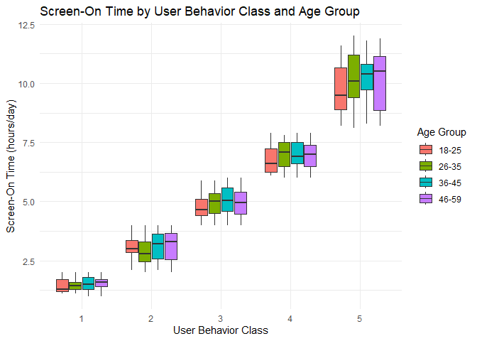

Final Project
================
Minh Nguyen, Bach Nguyen, Thien Nguyen
2024-12-10

## Abstract

The project focuses on analyzing smartphone usage patterns to predict
user behavior. It utilizes a dataset containing variables such as screen
time, app usage, and battery drain to identify key trends and
correlations. By visualizing and modeling these relationships, the study
aims to uncover factors that influence smartphone interaction and user
categorization. The findings could provide insights into improving
smartphone design, app optimization, and user experience.

## Importing libraries

``` r
library(RColorBrewer)
library(viridis)
```

    ## Warning: package 'viridis' was built under R version 4.4.2

    ## Loading required package: viridisLite

``` r
library(psych)
```

    ## Warning: package 'psych' was built under R version 4.4.2

``` r
library(dplyr)
```

    ## 
    ## Attaching package: 'dplyr'

    ## The following objects are masked from 'package:stats':
    ## 
    ##     filter, lag

    ## The following objects are masked from 'package:base':
    ## 
    ##     intersect, setdiff, setequal, union

``` r
library(ggplot2)
```

    ## 
    ## Attaching package: 'ggplot2'

    ## The following objects are masked from 'package:psych':
    ## 
    ##     %+%, alpha

``` r
library(patchwork)
```

    ## Warning: package 'patchwork' was built under R version 4.4.2

``` r
library(tidyr)
library(corrplot)
```

    ## Warning: package 'corrplot' was built under R version 4.4.2

    ## corrplot 0.95 loaded

``` r
library(png)
library(magick)
```

    ## Warning: package 'magick' was built under R version 4.4.2

    ## Linking to ImageMagick 6.9.12.98
    ## Enabled features: cairo, freetype, fftw, ghostscript, heic, lcms, pango, raw, rsvg, webp
    ## Disabled features: fontconfig, x11

``` r
library(ggcorrplot)
```

    ## Warning: package 'ggcorrplot' was built under R version 4.4.2

``` r
library(gridExtra)
```

    ## 
    ## Attaching package: 'gridExtra'

    ## The following object is masked from 'package:dplyr':
    ## 
    ##     combine

## Data

The dataset contains information about smartphone usage patterns for 700
users, including demographic and behavioral variables. Key variables
include app usage time (in minutes per day), screen-on time (in hours
per day), battery drain (in mAh), and data usage (in MB per day).
Demographic attributes such as age, gender, and operating system
(Android/iOS) are also included, along with the number of apps installed
on each device. The target variable, user behavior class, categorizes
users based on their smartphone interaction. These variables
collectively provide a comprehensive view of user behavior, enabling
detailed analysis and prediction.

Data link:
<https://www.kaggle.com/datasets/valakhorasani/mobile-device-usage-and-user-behavior-dataset/data>

## Load & Exploring Data

``` r
df <- read.csv("user_behavior_dataset.csv")
head(df)
```

    ##   User.ID   Device.Model Operating.System App.Usage.Time..min.day.
    ## 1       1 Google Pixel 5          Android                      393
    ## 2       2      OnePlus 9          Android                      268
    ## 3       3   Xiaomi Mi 11          Android                      154
    ## 4       4 Google Pixel 5          Android                      239
    ## 5       5      iPhone 12              iOS                      187
    ## 6       6 Google Pixel 5          Android                       99
    ##   Screen.On.Time..hours.day. Battery.Drain..mAh.day. Number.of.Apps.Installed
    ## 1                        6.4                    1872                       67
    ## 2                        4.7                    1331                       42
    ## 3                        4.0                     761                       32
    ## 4                        4.8                    1676                       56
    ## 5                        4.3                    1367                       58
    ## 6                        2.0                     940                       35
    ##   Data.Usage..MB.day. Age Gender User.Behavior.Class
    ## 1                1122  40   Male                   4
    ## 2                 944  47 Female                   3
    ## 3                 322  42   Male                   2
    ## 4                 871  20   Male                   3
    ## 5                 988  31 Female                   3
    ## 6                 564  31   Male                   2

``` r
df <- df[, !names(df) %in% "User.ID"]
tail(df)
```

    ##           Device.Model Operating.System App.Usage.Time..min.day.
    ## 695 Samsung Galaxy S21          Android                      564
    ## 696          iPhone 12              iOS                       92
    ## 697       Xiaomi Mi 11          Android                      316
    ## 698     Google Pixel 5          Android                       99
    ## 699 Samsung Galaxy S21          Android                       62
    ## 700          OnePlus 9          Android                      212
    ##     Screen.On.Time..hours.day. Battery.Drain..mAh.day. Number.of.Apps.Installed
    ## 695                        9.7                    2422                       83
    ## 696                        3.9                    1082                       26
    ## 697                        6.8                    1965                       68
    ## 698                        3.1                     942                       22
    ## 699                        1.7                     431                       13
    ## 700                        5.4                    1306                       49
    ##     Data.Usage..MB.day. Age Gender User.Behavior.Class
    ## 695                1985  34 Female                   5
    ## 696                 381  22   Male                   2
    ## 697                1201  59   Male                   4
    ## 698                 457  50 Female                   2
    ## 699                 224  44   Male                   1
    ## 700                 828  23 Female                   3

``` r
dim(df)
```

    ## [1] 700  10

``` r
nrow(df)
```

    ## [1] 700

``` r
ncol(df)
```

    ## [1] 10

``` r
str(df)
```

    ## 'data.frame':    700 obs. of  10 variables:
    ##  $ Device.Model              : chr  "Google Pixel 5" "OnePlus 9" "Xiaomi Mi 11" "Google Pixel 5" ...
    ##  $ Operating.System          : chr  "Android" "Android" "Android" "Android" ...
    ##  $ App.Usage.Time..min.day.  : int  393 268 154 239 187 99 350 543 340 424 ...
    ##  $ Screen.On.Time..hours.day.: num  6.4 4.7 4 4.8 4.3 2 7.3 11.4 7.7 6.6 ...
    ##  $ Battery.Drain..mAh.day.   : int  1872 1331 761 1676 1367 940 1802 2956 2138 1957 ...
    ##  $ Number.of.Apps.Installed  : int  67 42 32 56 58 35 66 82 75 75 ...
    ##  $ Data.Usage..MB.day.       : int  1122 944 322 871 988 564 1054 1702 1053 1301 ...
    ##  $ Age                       : int  40 47 42 20 31 31 21 31 42 42 ...
    ##  $ Gender                    : chr  "Male" "Female" "Male" "Male" ...
    ##  $ User.Behavior.Class       : int  4 3 2 3 3 2 4 5 4 4 ...

``` r
summary(df)
```

    ##  Device.Model       Operating.System   App.Usage.Time..min.day.
    ##  Length:700         Length:700         Min.   : 30.0           
    ##  Class :character   Class :character   1st Qu.:113.2           
    ##  Mode  :character   Mode  :character   Median :227.5           
    ##                                        Mean   :271.1           
    ##                                        3rd Qu.:434.2           
    ##                                        Max.   :598.0           
    ##  Screen.On.Time..hours.day. Battery.Drain..mAh.day. Number.of.Apps.Installed
    ##  Min.   : 1.000             Min.   : 302.0          Min.   :10.00           
    ##  1st Qu.: 2.500             1st Qu.: 722.2          1st Qu.:26.00           
    ##  Median : 4.900             Median :1502.5          Median :49.00           
    ##  Mean   : 5.273             Mean   :1525.2          Mean   :50.68           
    ##  3rd Qu.: 7.400             3rd Qu.:2229.5          3rd Qu.:74.00           
    ##  Max.   :12.000             Max.   :2993.0          Max.   :99.00           
    ##  Data.Usage..MB.day.      Age           Gender          User.Behavior.Class
    ##  Min.   : 102.0      Min.   :18.00   Length:700         Min.   :1.00       
    ##  1st Qu.: 373.0      1st Qu.:28.00   Class :character   1st Qu.:2.00       
    ##  Median : 823.5      Median :38.00   Mode  :character   Median :3.00       
    ##  Mean   : 929.7      Mean   :38.48                      Mean   :2.99       
    ##  3rd Qu.:1341.0      3rd Qu.:49.00                      3rd Qu.:4.00       
    ##  Max.   :2497.0      Max.   :59.00                      Max.   :5.00

``` r
describe(df)
```

    ##                            vars   n    mean     sd median trimmed     mad min
    ## Device.Model*                 1 700    2.99   1.43    3.0    2.99    1.48   1
    ## Operating.System*             2 700    1.21   0.41    1.0    1.14    0.00   1
    ## App.Usage.Time..min.day.      3 700  271.13 177.20  227.5  262.28  216.46  30
    ## Screen.On.Time..hours.day.    4 700    5.27   3.07    4.9    5.05    3.56   1
    ## Battery.Drain..mAh.day.       5 700 1525.16 819.14 1502.5 1502.34 1132.71 302
    ## Number.of.Apps.Installed      6 700   50.68  26.94   49.0   50.12   35.58  10
    ## Data.Usage..MB.day.           7 700  929.74 640.45  823.5  865.68  706.46 102
    ## Age                           8 700   38.48  12.01   38.0   38.45   16.31  18
    ## Gender*                       9 700    1.52   0.50    2.0    1.52    0.00   1
    ## User.Behavior.Class          10 700    2.99   1.40    3.0    2.99    1.48   1
    ##                             max range  skew kurtosis    se
    ## Device.Model*                 5     4  0.02    -1.33  0.05
    ## Operating.System*             2     1  1.43     0.05  0.02
    ## App.Usage.Time..min.day.    598   568  0.37    -1.26  6.70
    ## Screen.On.Time..hours.day.   12    11  0.46    -0.83  0.12
    ## Battery.Drain..mAh.day.    2993  2691  0.13    -1.28 30.96
    ## Number.of.Apps.Installed     99    89  0.11    -1.26  1.02
    ## Data.Usage..MB.day.        2497  2395  0.70    -0.47 24.21
    ## Age                          59    41  0.03    -1.24  0.45
    ## Gender*                       2     1 -0.08    -2.00  0.02
    ## User.Behavior.Class           5     4  0.02    -1.28  0.05

``` r
colSums(is.na(df))
```

    ##               Device.Model           Operating.System 
    ##                          0                          0 
    ##   App.Usage.Time..min.day. Screen.On.Time..hours.day. 
    ##                          0                          0 
    ##    Battery.Drain..mAh.day.   Number.of.Apps.Installed 
    ##                          0                          0 
    ##        Data.Usage..MB.day.                        Age 
    ##                          0                          0 
    ##                     Gender        User.Behavior.Class 
    ##                          0                          0

``` r
sum(duplicated(df))
```

    ## [1] 0

## Explanatory Data Analysis

``` r
ggplot(df, aes(x = Device.Model, fill = Device.Model)) +
  geom_bar() +
  labs(title = "Device Model Analysis", 
       x = "Model", 
       y = "Total Devices") +
  theme_minimal() +
  theme(axis.text.x = element_text(angle = 45, hjust = 1)) +
  scale_fill_viridis_d()  # Use Viridis color palette for discrete categories
```

<!-- -->

``` r
ggplot(df, aes(x = Operating.System, fill = Operating.System)) +
  geom_bar() +
  scale_fill_viridis(discrete = TRUE) +  # Viridis for discrete categories
  labs(title = "Operating System Analysis", 
       x = "Operating System", 
       y = "Total Devices") +
  theme_minimal() +
  theme(axis.text.x = element_text(angle = 45, hjust = 1)) +
  theme(plot.title = element_text(size = 16, hjust = 0.5))
```

<!-- -->

``` r
ggplot(df, aes(x = Gender, fill = Gender)) +
  geom_bar() +
  scale_fill_brewer(palette = "Set2") +  # Use a different palette (e.g., Set2)
  labs(title = "Gender Analysis", 
       x = "Gender", 
       y = "Total Devices") +
  theme_minimal() +
  theme(axis.text.x = element_text(angle = 0, hjust = 0.5)) +
  theme(plot.title = element_text(size = 16, hjust = 0.5))
```

<!-- -->

``` r
columns <- c('App.Usage.Time..min.day.', 'Screen.On.Time..hours.day.',
             'Battery.Drain..mAh.day.', 'Number.of.Apps.Installed',
             'Data.Usage..MB.day.', 'Age')

# Create individual histograms for each column
plots <- lapply(columns, function(col) {
  ggplot(df, aes_string(x = col)) +
    geom_histogram(aes(y = ..density..), bins = 30, fill = "green", color = "black", alpha = 0.7) +
    geom_density(color = "darkgreen") +
    labs(title = col, x = gsub("\\.\\.", " ", col), y = "Density") +
    theme_minimal()
})
```

    ## Warning: `aes_string()` was deprecated in ggplot2 3.0.0.
    ## ℹ Please use tidy evaluation idioms with `aes()`.
    ## ℹ See also `vignette("ggplot2-in-packages")` for more information.
    ## This warning is displayed once every 8 hours.
    ## Call `lifecycle::last_lifecycle_warnings()` to see where this warning was
    ## generated.

``` r
combined_plot <- Reduce(`+`, plots) + plot_layout(ncol = 3)
combined_plot
```

    ## Warning: The dot-dot notation (`..density..`) was deprecated in ggplot2 3.4.0.
    ## ℹ Please use `after_stat(density)` instead.
    ## This warning is displayed once every 8 hours.
    ## Call `lifecycle::last_lifecycle_warnings()` to see where this warning was
    ## generated.

<!-- -->

``` r
ggplot(df, aes(x = User.Behavior.Class)) +
  geom_bar(fill = "skyblue", color = "black") +  
  labs(title = "Dependent Feature Distribution", 
       x = "User Behavior Class", 
       y = "Count") +
  theme_minimal() +
  theme(plot.title = element_text(size = 16, hjust = 0.5),
        axis.text.x = element_text(angle = 0, hjust = 0.5))
```

<!-- -->

``` r
device_model_dummies <- model.matrix(~ Device.Model - 1, data = df)


operating_system_dummies <- model.matrix(~ Operating.System - 1, data = df)


df <- cbind(df, device_model_dummies, operating_system_dummies)


df <- df %>% select(-Device.Model, -Operating.System)


df <- df %>% mutate(Gender = ifelse(Gender == "Male", 1, 0))
```

``` r
df_long <- df %>%
  pivot_longer(cols = everything(), names_to = "Variable", values_to = "Value")

ggplot(df_long, aes(x = Variable, y = Value, fill = Variable)) +
  geom_boxplot(outlier.color = "red", outlier.shape = 16, alpha = 0.7) +
  scale_fill_viridis_d(option = "E") +  # Use a Viridis palette
  labs(title = "Boxplot", x = NULL, y = "Value") +
  theme_minimal() +
  theme(
    axis.text.x = element_text(angle = 75, hjust = 1),
    legend.position = "none"
  )
```

<!-- -->

``` r
# Compute the correlation matrix
cor_matrix <- cor(df, use = "complete.obs")

# Save the heatmap to a larger figure
png("correlation_heatmap.png", width = 1600, height = 1200, res = 150)  # Adjust dimensions and resolution
corrplot(cor_matrix, method = "color", col = viridis(200), 
         title = "Correlation Heatmap", addCoef.col = "white", 
         tl.cex = 1.2, number.cex = 1.0, tl.srt = 45)
dev.off()
```

    ## png 
    ##   2

``` r
library(magick)
img <- image_read("correlation_heatmap.png")

print(img)
```

    ## # A tibble: 1 × 7
    ##   format width height colorspace matte filesize density
    ##   <chr>  <int>  <int> <chr>      <lgl>    <int> <chr>  
    ## 1 PNG     1600   1200 sRGB       FALSE   174036 59x59


``` r
df$Gender <- as.factor(df$Gender)
cor_data <- df %>%
  select(App.Usage.Time..min.day., Screen.On.Time..hours.day., Battery.Drain..mAh.day., 
         Number.of.Apps.Installed, Data.Usage..MB.day., Age)
cor_matrix <- cor(cor_data)
corr_plot <- ggcorrplot(cor_matrix, lab = TRUE, title = "Correlation Heatmap")
corr_plot
```

<!-- -->

``` r
screen_gender_plot <- ggplot(df, aes(x = Gender, y = Screen.On.Time..hours.day.)) +
  geom_boxplot(fill = "skyblue") +
  labs(title = "Screen On Time by Gender", x = "Gender", y = "Screen On Time (hours/day)") +
  theme_minimal()
screen_gender_plot
```

<!-- -->

``` r
scatter_plot <- ggplot(df, aes(x = Screen.On.Time..hours.day., y = Battery.Drain..mAh.day.)) +
  geom_point(alpha = 0.6, color = "blue") +
  labs(title = "Screen Time vs. Battery Drain", x = "Screen On Time (hours/day)", y = "Battery Drain (mAh/day)") +
  theme_minimal()
scatter_plot
```

<!-- -->

``` r
usage_histogram <- ggplot(df, aes(x = App.Usage.Time..min.day.)) +
  geom_histogram(binwidth = 30, fill = "purple", color = "black") +
  labs(title = "Histogram of App Usage Time", x = "App Usage Time (min/day)", y = "Frequency") +
  theme_minimal()
usage_histogram
```

<!-- -->

``` r
age_behavior_plot <- ggplot(df, aes(x = factor(User.Behavior.Class), y = Age)) +
  geom_boxplot(fill = "lightgreen") +
  labs(title = "Age Distribution by User Behavior Class", x = "User Behavior Class", y = "Age") +
  theme_minimal()
age_behavior_plot
```

<!-- -->

``` r
gender_behavior_plot <- ggplot(df, aes(x = Gender, fill = factor(User.Behavior.Class))) +
  geom_bar(position = "fill") +
  labs(title = "Proportion of Behavior Classes by Gender", x = "Gender", y = "Proportion", fill = "Behavior Class") +
  theme_minimal()
gender_behavior_plot
```

<!-- -->

## Conclusion

The conclusions drawn from this analysis logically follow the results
and findings. The study revealed significant correlations between key
variables such as screen time, battery drain, and app usage,
highlighting their impact on user behavior. These insights provide a
foundation for deeper exploration into personalized smartphone
experiences and optimizing app design for better energy efficiency.
Further questions arise regarding how external factors, such as work
habits or cultural differences, influence smartphone usage patterns.
Future research could expand on this work by incorporating longitudinal
data to observe changes in behavior over time or exploring the impact of
emerging technologies, such as wearable devices, on user interaction.
These directions could provide a more comprehensive understanding of
digital behavior in an increasingly connected world.
